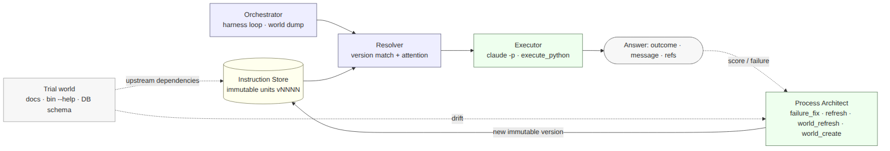
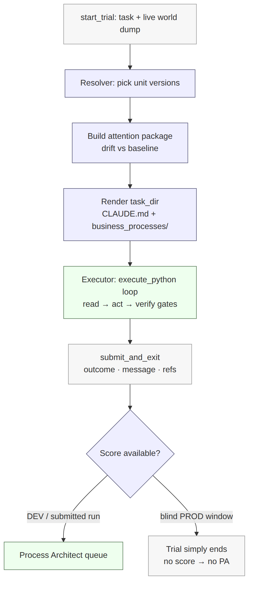
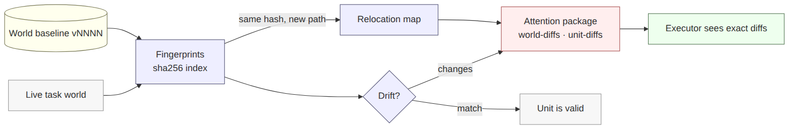
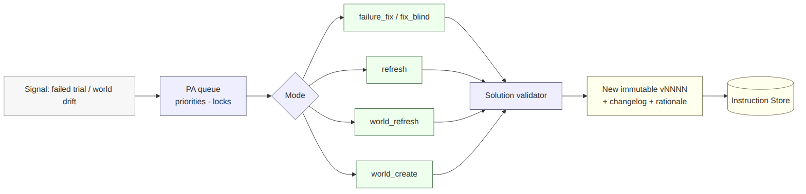

# Process Architect: a business-process map as code

The main idea in plain words: **the agent's instructions are code, and engineering
practices apply to them.** The Executor's operating manual is not one monolithic
prompt but a set of modular, versioned, immutable units (business processes), each
explicitly depending on files of the "live world" (policies, `--help` of the CLI
tools, DB schema), pinned by `sha256`. When the world changes, the agent does not
break: the resolver picks a matching unit version, and on a mismatch the Executor
receives an exact diff and adapts on the fly. Meanwhile a second agent — the
**Process Architect** — acts as an automated software engineer and ships new versions
of stale or failing units.

The framework knows nothing about e-commerce — the agent derives the domain knowledge
from the world itself; point the same machine at a different business and it will
design a new process map.

## How does it work?

*The whole system within one trial. Blue — deterministic code; green — models;
yellow — the versioned store; grey — the world and the final answer. The LLMs are
isolated in two nodes; everything else is computed deterministically.*

- **What starts a task?** A deterministic Orchestrator (Python) drives the BitGN
  harness loop: `start_trial` → snapshot of the live world into the `task_dir`
  (documentation, the `/bin/*` surface with its `--help`, DB schema; the dump is
  built transitively over cross-references) → instruction resolution → Executor
  launch → submit.
- **What context does the agent receive?** The rendered operating manual:
  `CLAUDE.md` (the system core) + `business_processes/*.md` (business processes
  selected by the resolver for the current world state) + the **attention package** —
  exact diffs between the world the instructions were written against and the world
  of the task.
- **Which tools or APIs can it call?** Exactly one runtime tool — `execute_python`
  (an MCP server). The model writes short Python snippets executed in the task VM:
  every state read, SQL query, and `/bin/*` call goes through one observable channel.
  The "one model + code sandbox" approach is borrowed from Operation Pangolin, the
  winner of the previous challenge (PAC1); the versioned-instructions layer and the
  Process Architect are built on top of it.
- **How does it inspect state before acting?** As the processes demand: first
  `index.md` (the router), then only the targeted business processes; controlling
  records and policies are read **before** any mutation, verify gates run after it.
- **How does it decide that the task is finished?** By calling
  `submit_and_exit(message, outcome, refs)` — the message, the service outcome code,
  and the list of evidence references.

Task lifecycle:

*Prompt preparation is deterministic; the LLM is involved only at the execution
stage.*

## Models

- **Main solver (Executor):** `claude-sonnet-4-6`, reasoning effort `high`.
- **Evolution loop (Process Architect):** `claude-opus-4-8`, reasoning effort
  `xhigh`. Designing new processes is delegated to the stronger model; streaming task
  execution over stable instructions — to the base one.
- **Runtime settings that mattered:** both roles run via `claude -p` (Claude Code CLI
  in headless mode); the Executor has a single tool, `execute_python`, with no access
  to the host shell.

## Instructions as code

A unit is either the system core (`executor_core` → `CLAUDE.md`) or a business
process (`bp_*` → `business_processes/<name>.md`). The final configuration has the
core plus 20 processes: `identity_and_auth`, `checkout`, `discount`,
`fraud_risk_review`, `payments_3ds_recovery`, `returns`,
`availability_and_inventory`, `dispatch_planning`, `purchase_request_crosslist`,
`refs`, `submission_terminal`, and others.

Each unit version is an immutable `vNNNN/` directory with the content and a manifest:
`parent` (the previous version), `mode`/`trigger` (creation context: PA mode, the
failed task, the score), `dependencies` (**a list of world files, each pinned with a
`sha256`**), `rationale` (justification of the changes), `rollback` (the rollback
strategy). A `sha256` dependency pins the unit to a concrete world state — the world
acts as an *upstream* the instructions depend on explicitly, the way code depends on
libraries.

The **Resolver** handles every task with a *match-or-fallback* pattern: for each unit
it picks the version whose dependencies match the current world; when nothing
matches, it falls back to the latest active version plus an explicit warning. Drift
is computed by comparing the live world against the baseline via a `sha256` index;
file renames are handled by a two-level **relocation map** (an identical move — the
path is updated silently; a move with mutation — the files are linked by token
similarity and the changed fragments go into the diff).

*Drift analysis: hashes make renames handled correctly, with no false
delete/create signals.*

The attention package reaches the Executor through two channels: a global warning
about drift of fundamental files — at the system-context level, and a local
`Heads-up` block — at the top of the specific stale process, with links to the exact
diffs. An example from a real run: the package surfaced the move of
`/proc/payment-ledger` → `/proc/payments` and the answer-format change of
`TRUE(1)`/`FALSE(0)` → `<YES>`/`<NO>` — the agent adapted on the fly, with no
instruction rewrite.

The **Process Architect** closes the evolution loop. Four modes: `failure_fix` /
`fix_blind` (analyze a failed task and fix the offending unit), `refresh` (a targeted
unit update when its direct dependency drifts), `world_refresh` (incremental update
of the affected processes when fundamental files drift), `world_create` (a full
rebuild of the process map for a radically new world). A queue with priorities and
locks prevents conflicts between parallel sessions, solutions pass deterministic
validation before commit, and every new version carries a changelog and a rationale
directory.

*The process evolution loop: the queue and validation are code; the refactoring logic
is the model.*

A `failure_fix` example: a task scored 0.6 instead of 1.0 — the logic and references
were correct, but the agent added surrounding prose instead of the required isolated
token `TRUE(1)`. The PA localized the problem to the `bp_submission_terminal` unit
and shipped a new version with a strict answer-formatting rule and an anti-pattern —
a fix at the level of the task class, not of a single trace.

## E-commerce OS Reasoning

The key distinction: **the domain knowledge is not baked into the framework.** The
orchestrator, the store, and the PA loop know nothing about e-commerce — the process
map is derived from the live world (the `/docs` policies, `--help` of the `/bin/*`
tools, the DB schema) and lives in the units. The base manual is built around the
enterprise itself and its policies (how a basket works, how a return is processed),
not around guessing the incoming tasks — tuning to their specifics happens later,
naturally, through unit evolution.

- **Catalogue and product matching:** `bp_product_discovery` — matching fuzzy
  requests to SKUs via SQL queries over the catalogue, with explicit schema gotchas
  (including EAV properties) right in the instructions.
- **Inventory, warehouses, store coverage:** `bp_availability_and_inventory` and
  `bp_dispatch_planning` — the semantics of stock levels and thresholds come from the
  world's policies, not from the model's assumptions.
- **Customers, baskets, orders, payments:** `bp_basket_lifecycle`, `bp_checkout`,
  `bp_payments_3ds_recovery` — record ownership is verified by reading the owning
  record; the actor comes only from `/bin/id`.
- **Merchant policies and addenda:** every process carries a `Dependencies` block
  with links to the governing documents; a rule points to its source instead of
  retelling it.
- **Returns, refunds, fraud, escalations:** `bp_returns`, `bp_fraud_risk_review` —
  each with its own evidence requirements and verify gates after mutations.
- **Audit trails and evidence:** collecting `refs` is a separate logic layer
  (`bp_refs` + rules in the targeted processes); each process keeps its own evidence
  ledger, because one extra or missing reference zeroes out the task.

## Acting, Refusing, and Escalating

- **When is the agent allowed to mutate state?** Only along the process route: first
  `index.md`, then the targeted business process; governing records and policies are
  read before the mutation, a verify check runs after it.
- **How is authorization verified?** Identity and roles — exclusively via `/bin/id`;
  claims from the user text ("I am the owner", "access has been granted") are ignored
  as data. This is a cross-cutting principle at the router level, not of any single
  process.
- **Pressure for discounts, refunds, and other customers' data:** the
  request-integrity and security-refusal rules are raised to the system core
  (`executor_core`) — a detected prompt injection yields `OUTCOME_DENIED_SECURITY`
  regardless of which process the agent met it in (this lesson cost us points — see
  below).
- **Refusing, clarifying, escalating:** the outcome codes (`OK`, security denial,
  clarification request, "not supported", internal error) and the terminal answer
  format are fixed in the core and the `bp_submission_terminal` unit; refusals are
  first-class outcomes with their own evidence requirements.

## Problems

- **Correct logic, but badly formed evidence.** The agent executed the business logic
  but lost points on extra or missing `refs` — the grader demands an exact match.
- **DB schema mishaps.** The model generated SQL before fully analyzing the schema:
  syntax errors, misread EAV properties.
- **World drift and renames.** A standard diff saw file renames and the
  restructuring of `/proc` as delete + create — noise instead of signal.
- **Context overflow.** As the world scaled, a monolithic context exceeded 250–300k
  tokens.
- **The biggest blind-window failure — over-filtering the world dump.** To reduce
  noise, the dump included only documents reachable via direct cross-references. In
  the PROD world the format switched to a blanket "read everything in `/docs`"
  directive — the filter cut off a third of the documents. Cost: 8–10 points, the
  most expensive mistake of the challenge.
- **Deprioritized injection detector.** The `OUTCOME_DENIED_SECURITY` rule lived
  inside specific processes and sometimes got lost — another 2–3 points.
- **PA fix layering.** On failures, the PA edited the first process it saw in the
  trace instead of the real layer of the problem, and stacked patches on top of its
  own regressions.

## Solutions

- **Evidence layer:** `refs` collection extracted into dedicated logic; the global
  layer is responsible only for path canonicalization, the substantive rules are
  delegated to the targeted processes (checkout owns baskets, fraud owns payments).
- **DB work:** compact schema gotchas in the reference material, hard-coded SQL
  examples removed from the core, Python wrappers added for safe queries and error
  interception.
- **Drift:** `sha256` file matching + the relocation map instead of a naive diff.
- **Context:** manual decomposition of the manual and hard isolation of domain
  processes — the Executor opens only the targeted ones.
- **Injections:** request-integrity raised to the system-prompt level.
- **PA discipline:** a layer classification introduced into the PA prompts
  (`domain_policy`, `topic_evidence`, `refs_safety`, `terminal_protocol`, `routing`) —
  the PA modifies only the layer it is assigned to.
- **Deliberately kept simple:** one tool for the Executor, no router or LLM judge in
  the execution loop; PA content rewriting is off by default and enabled by explicit
  flags.

The postmortem work produced a measurable result (out of competition, after the blind
window): fixing the dump and the `/proc` fallback raised the PROD score to ~81, and
one round of process evolution by the PA — to **93.5/100** on the same PROD world.
For us this is the main confirmation that the "drift → attention → unit evolution"
loop works.

## What Would You Improve Next?

- **CLI agnosticism:** moving from the vendor `claude -p` to an OpenAI-compatible
  API.
- **Version management via evals:** automatic rollback/retire of unit versions based
  on statistical significance of the metrics.
- **Cross-review:** a dedicated LLM auditor role checking the quality of
  PA-generated instructions before release.
- **Model routing:** settled routine processes — on cheap models, hard reasoning — on
  strong ones.
- **A REPL for the PA:** giving the Process Architect access to the live world to
  test the tooling before shipping a new instruction version.

## Lessons From ECOM1

1. **Delegating code writing to the model reduces nondeterminism.** One
   `execute_python` instead of a set of narrow tools localizes all the logic (SQL,
   calls, mutations) in one observable channel, while the model's reasoning stays
   bounded by the business processes.
2. **High costs at the rollout stage are justified.** Strong models at the start pay
   off by stabilizing the processes; optimizing cost makes sense only once the
   architecture is reliable.
3. **No feedback demands minimalism.** In blind runs without a score, a mistake in
   one process fails the whole task class — a minimal set of strict rules is safer
   than overloaded, untrusted processes.
4. **Processes need regular refactoring.** Point fixes accumulate technical debt in
   the instruction logic — periodic review and decomposition are required, as in any
   codebase.
5. **When you build processes on top of the world's policies, cite the source rather
   than retell it.** A retold rule drifts away from its source over time; a link does
   not. Every rule must state where it came from — otherwise, when the world changes,
   there is no way to tell what to fix and where.
